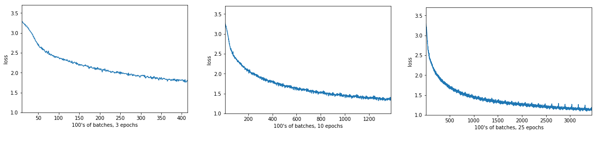

## Function top_k

The function **torch.topk(_input_, k,...)**  r
eturns the _k_ largest elements of the given _input_ tensor 
along a given dimension, where _k_(int) – the k in “top-k”.

## Function predict

The function **predict(char,top_k,...)** calls the function **torch.topk**.
In this notebook, we set _top_k = 5_. 
The output of our **RNN** is from a fully-connected layer and 
it outputs a distribution of next-character scores.
To actually get the next character, we apply a softmax function, 
which gives us a probability distribution that we can then sample 
to predict the next character.

## Function sample

The function **sample(net, size, prime='The', top_k=top_k...)**
calls the function **predict**.   The _size_ is the size of the generated text.
The model is trained on the text _Anna Karenina_, and we call
the function **sample** with the start word _prime='Anna'_.

For the model is trained, we want to sample from it. 
To sample, we pass in a character and we get the predict 
for the next character. Then we take that character, pass it back in, 
and get another predicted character.
Just keep doing this we generate a text!

We can make the sample text and make it more reasonable to handle 
(with less variables) by only considering some _K_ most probable characters.
This will prevent the network from giving us completely absurd characters 
while allowing it to introduce some noise into the sampled text.

## Test

With an increase in the number n_epoch, the value of the loss function decreases, 
and the result actually improves. I did 3 experinces with n_epoch = 3, 10 and 25. 

