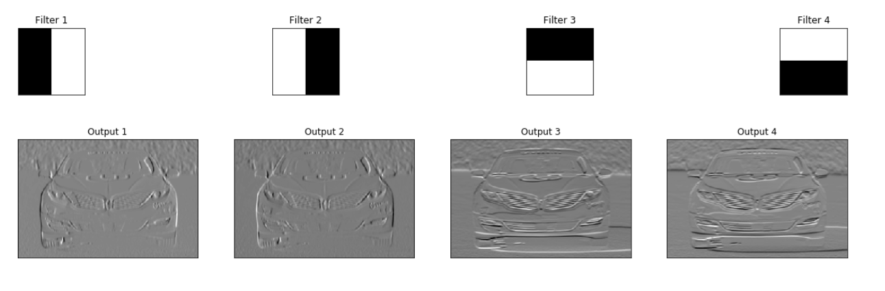
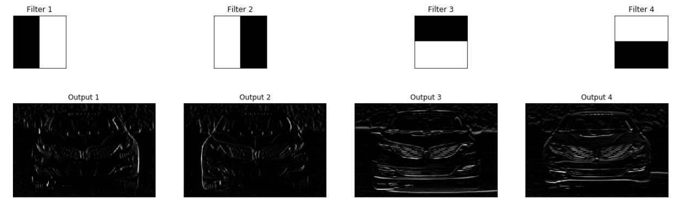
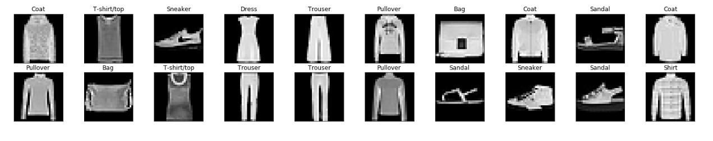
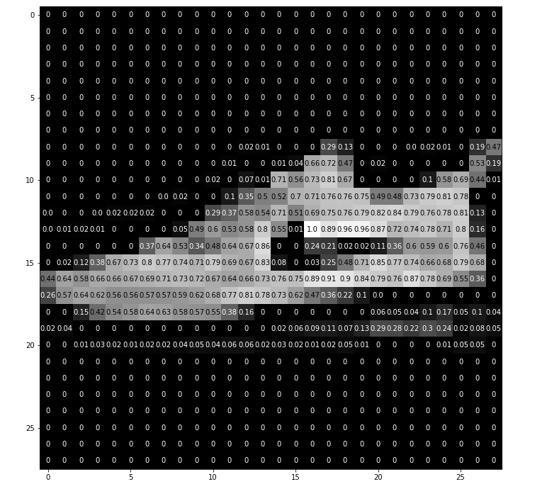

## Visualize 4 filtered outputs of a convolutional layer

1.ConvLayerVizualization.ipynb

This notebook demonstrates a neural network with a single convolutional layer 
with four filters. Instantiate the model and set the weights

weight = torch.from_numpy(filters).unsqueeze(1).type(torch.FloatTensor)
model = Net(weight)

We visualize the output of each filter: 

## Visualize the output of a maxpooling layer in a CNN

2.PoolVizualization.ipynb

Initialize a convolutional layer so that it contains all 4 created filters.
Then add a maxpooling layer, 
[documented here](http://pytorch.org/docs/master/_modules/torch/nn/modules/pooling.html), 
with a kernel size of (4x4) so you can really see that the image resolution has been 
reduced after this step!

We visualize the output of the pooling layer: 

## Load and transform the data

3.LoadAndVizualizFashionMNIST.ipynb  

Train data, number of images:  60000.
We vizualize representatives for each of 20 classes:

The representative of __class sneaker__ we  display in details: 

Turning all our images into Tensor's for training a neural network.
We define a transform to read the data in as a tensor.

data_transform = transforms.ToTensor()
rain_data = FashionMNIST(root='./data', train=True,
                        download=False, transform=data_transform)

Important: *Tensors are similar to numpy arrays, but can also be used
 on a GPU to accelerate computing.*

## Train a CNN to classify images from the Fashion-MNIST database

4.ClassificationFashionMNIST.ipynb and 
4.ClassifFashionMNIST_batchsize-10.ipynb

In this cell, we load in both _training_ and _test_ datasets from the 
[FashionMNIST class](https://github.com/zalandoresearch/fashion-mnist).

The network architecture of ClassificationFashionMNIST.ipynb is defined as follows:

        # 1 input image channel (grayscale), 10 output channels/feature maps,  3x3 square convolution kernel
        # output size = (W-F)/S +1 = (28-3)/1 +1 = 26
        # the output Tensor for one image, will have the dimensions: (10, 26, 26), after pool layer: (10, 13, 13)
        self.conv1 = nn.Conv2d(1, 10, 3)
        
        # maxpool layer with kernel_size=2, stride=2
        self.pool = nn.MaxPool2d(2, 2)
        
        # second conv layer: 10 inputs, 20 outputs, 3x3 conv
        # output size = (W-F)/S +1 = (13-3)/1 +1 = 11
        # the output tensor will have dimensions: (20, 11, 11)
        # after another pool layer this becomes (20, 5, 5); 5.5 is rounded down
        self.conv2 = nn.Conv2d(10, 20, 3)
        
        # 20 outputs * the 5*5 filtered/pooled map size
        # 10 output channels (for the 10 classes)
        self.fc1 = nn.Linear(20*5*5, 10)

Two layers are added to the architecture of ClassificationFashionMNIST_batchsize-10.ipynb

        # dropout with p=0.4
        self.fc1_drop = nn.Dropout(p=0.4)
        
        # finally, create 10 output channels (for the 10 classes)
        self.fc2 = nn.Linear(50, 10)

### A note on output size

For any convolutional layer, the output feature maps will have the specified depth
(a depth of 10 for 10 filters in a convolutional layer) and the dimensions 
of the produced feature maps (width/height) can be computed as the 
_input image_ width/height, W, minus the filter size, F, divided by the stride, 
S, all + 1. The equation looks like: `output_dim = (W-F)/S + 1`, 
for an assumed padding size of 0. You can find a derivation of this formula, 
[here](http://cs231n.github.io/convolutional-networks/#conv).

## Feature Visualization

 We extract and visualize the filter weights for [all of the filters](https://github.com/Rafael1s/Computer-Vision-Udacity/blob/master/FashionMNIST-CNN/visualizion_of_filter_weights.png) in the first convolutional layer.
 
 ### Activation Maps
 We use OpenCV's filter2D function to apply these filters to a sample test image and produce a series of activation maps as a result. We'll do this for the [first](https://github.com/Rafael1s/Computer-Vision-Udacity/blob/master/FashionMNIST-CNN/activation_map_first_ConvLayer.png) and [second](https://github.com/Rafael1s/Computer-Vision-Udacity/blob/master/FashionMNIST-CNN/activation_map_second_ConvLayer.png) convolutional layers.
 
