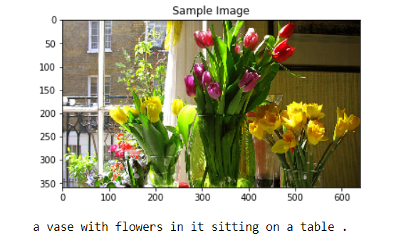
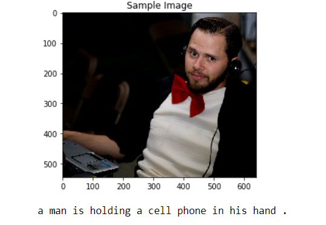
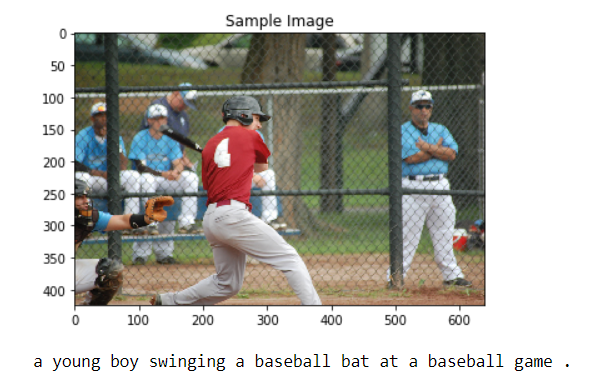
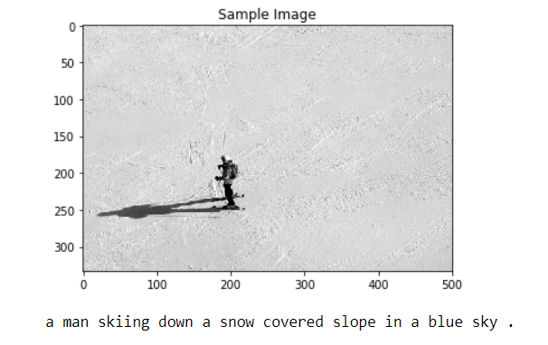
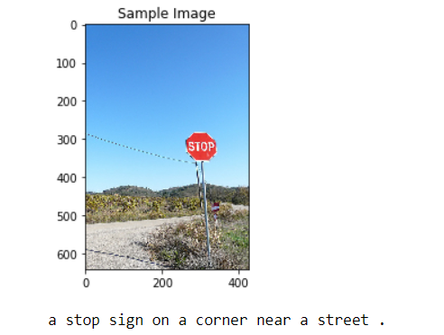

## Image Captioning Predicted Well

   

   

   

   

   

## Loss History    

total_step:  **3236**    

1.03% Epoch [1/3], Step [100/3236], Loss: 3.9948, Perplexity: 54.3140   
2.06% Epoch [1/3], Step [200/3236], Loss: 3.4490, Perplexity: 31.4680    
3.09% Epoch [1/3], Step [300/3236], Loss: 3.0621, Perplexity: 21.3721    
4.12% Epoch [1/3], Step [400/3236], Loss: 3.8173, Perplexity: 45.4820   
5.15% Epoch [1/3], Step [500/3236], Loss: 3.0329, Perplexity: 20.7575   
6.18% Epoch [1/3], Step [600/3236], Loss: 2.7768, Perplexity: 16.0668   
7.21% Epoch [1/3], Step [700/3236], Loss: 2.9239, Perplexity: 18.6137   
8.24% Epoch [1/3], Step [800/3236], Loss: 2.8792, Perplexity: 17.80005   
9.27% Epoch [1/3], Step [900/3236], Loss: 2.5830, Perplexity: 13.2363   
10.30% Epoch [1/3], Step [1000/3236], Loss: 2.6367, Perplexity: 13.9667   
11.33% Epoch [1/3], Step [1100/3236], Loss: 2.6356, Perplexity: 13.9510  
12.36% Epoch [1/3], Step [1200/3236], Loss: 2.4018, Perplexity: 11.0435   
13.39% Epoch [1/3], Step [1300/3236], Loss: 2.5224, Perplexity: 12.4580   
14.42% Epoch [1/3], Step [1400/3236], Loss: 2.4192, Perplexity: 11.2371   
15.45% Epoch [1/3], Step [1500/3236], Loss: 2.3404, Perplexity: 10.3858   
16.48% Epoch [1/3], Step [1600/3236], Loss: 2.3723, Perplexity: 10.7223   
17.51% Epoch [1/3], Step [1700/3236], Loss: 2.7902, Perplexity: 16.2850   
18.54% Epoch [1/3], Step [1800/3236], Loss: 2.2570, Perplexity: 9.55405   
19.57% Epoch [1/3], Step [1900/3236], Loss: 2.2717, Perplexity: 9.69557   
20.60% Epoch [1/3], Step [2000/3236], Loss: 2.7578, Perplexity: 15.7648   
21.63% Epoch [1/3], Step [2100/3236], Loss: 2.4207, Perplexity: 11.2542   
22.66% Epoch [1/3], Step [2200/3236], Loss: 2.2696, Perplexity: 9.67557   
23.69% Epoch [1/3], Step [2300/3236], Loss: 2.2164, Perplexity: 9.17465  
24.72% Epoch [1/3], Step [2400/3236], Loss: 2.3714, Perplexity: 10.7119   
25.75% Epoch [1/3], Step [2500/3236], Loss: 2.1870, Perplexity: 8.90863   
26.78% Epoch [1/3], Step [2600/3236], Loss: 2.2892, Perplexity: 9.86741   
27.81% Epoch [1/3], Step [2700/3236], Loss: 2.1282, Perplexity: 8.39961   
28.84% Epoch [1/3], Step [2800/3236], Loss: 2.1748, Perplexity: 8.80086   
29.87% Epoch [1/3], Step [2900/3236], Loss: 2.2739, Perplexity: 9.71777  
30.90% Epoch [1/3], Step [3000/3236], Loss: 3.2463, Perplexity: 25.6944   
31.93% Epoch [1/3], Step [3100/3236], Loss: 2.1033, Perplexity: 8.19318   
32.96% Epoch [1/3], Step [3200/3236], Loss: 2.0347, Perplexity: 7.64972   
34.36% Epoch [2/3], Step [100/3236], Loss: 2.1511, Perplexity: 8.594019   
35.39% Epoch [2/3], Step [200/3236], Loss: 2.1128, Perplexity: 8.27159   
36.42% Epoch [2/3], Step [300/3236], Loss: 2.1078, Perplexity: 8.23057   
37.45% Epoch [2/3], Step [400/3236], Loss: 2.5743, Perplexity: 13.1227   
38.48% Epoch [2/3], Step [500/3236], Loss: 2.1889, Perplexity: 8.92562   
39.51% Epoch [2/3], Step [600/3236], Loss: 2.0104, Perplexity: 7.46606   
40.54% Epoch [2/3], Step [700/3236], Loss: 2.1156, Perplexity: 8.29479   
41.57% Epoch [2/3], Step [800/3236], Loss: 2.1470, Perplexity: 8.55944   
42.60% Epoch [2/3], Step [900/3236], Loss: 1.9033, Perplexity: 6.70782   
43.63% Epoch [2/3], Step [1000/3236], Loss: 2.1354, Perplexity: 8.4604   
44.66% Epoch [2/3], Step [1100/3236], Loss: 2.0213, Perplexity: 7.54855   
45.69% Epoch [2/3], Step [1200/3236], Loss: 2.0310, Perplexity: 7.62175   
46.72% Epoch [2/3], Step [1300/3236], Loss: 1.9938, Perplexity: 7.34338   
47.75% Epoch [2/3], Step [1400/3236], Loss: 2.0519, Perplexity: 7.78278   
48.78% Epoch [2/3], Step [1500/3236], Loss: 2.0291, Perplexity: 7.60761   
49.81% Epoch [2/3], Step [1600/3236], Loss: 2.0646, Perplexity: 7.88249   
50.84% Epoch [2/3], Step [1700/3236], Loss: 1.9790, Perplexity: 7.23523   
51.87% Epoch [2/3], Step [1800/3236], Loss: 1.9405, Perplexity: 6.96252   
52.90% Epoch [2/3], Step [1900/3236], Loss: 2.3128, Perplexity: 10.1030   
53.93% Epoch [2/3], Step [2000/3236], Loss: 2.0007, Perplexity: 7.39465   
54.96% Epoch [2/3], Step [2100/3236], Loss: 2.0703, Perplexity: 7.92758   
56.00% Epoch [2/3], Step [2200/3236], Loss: 2.0610, Perplexity: 7.85384   
57.03% Epoch [2/3], Step [2300/3236], Loss: 2.2548, Perplexity: 9.53387   
58.06% Epoch [2/3], Step [2400/3236], Loss: 1.9347, Perplexity: 6.92190   
59.09% Epoch [2/3], Step [2500/3236], Loss: 1.8604, Perplexity: 6.42623   
60.12% Epoch [2/3], Step [2600/3236], Loss: 2.9339, Perplexity: 18.8005   
61.15% Epoch [2/3], Step [2700/3236], Loss: 2.0068, Perplexity: 7.43932   
62.18% Epoch [2/3], Step [2800/3236], Loss: 1.9135, Perplexity: 6.77700   
63.21% Epoch [2/3], Step [2900/3236], Loss: 1.9380, Perplexity: 6.94478   
64.24% Epoch [2/3], Step [3000/3236], Loss: 1.9583, Perplexity: 7.08730     
65.27% Epoch [2/3], Step [3100/3236], Loss: 2.1184, Perplexity: 8.31803    
66.30% Epoch [2/3], Step [3200/3236], Loss: 2.0542, Perplexity: 7.80072   
67.70% Epoch [3/3], Step [100/3236], Loss: 2.0164, Perplexity: 7.510907   
68.73% Epoch [3/3], Step [200/3236], Loss: 2.0398, Perplexity: 7.68885   
69.76% Epoch [3/3], Step [300/3236], Loss: 2.1033, Perplexity: 8.19287    
70.79% Epoch [3/3], Step [400/3236], Loss: 1.9206, Perplexity: 6.82535   
71.82% Epoch [3/3], Step [500/3236], Loss: 1.9711, Perplexity: 7.17826   
72.85% Epoch [3/3], Step [600/3236], Loss: 2.1651, Perplexity: 8.71554   
73.88% Epoch [3/3], Step [700/3236], Loss: 1.9372, Perplexity: 6.93906   
74.91% Epoch [3/3], Step [800/3236], Loss: 2.2066, Perplexity: 9.08476   
75.94% Epoch [3/3], Step [900/3236], Loss: 1.9298, Perplexity: 6.88820    
76.97% Epoch [3/3], Step [1000/3236], Loss: 2.9257, Perplexity: 18.6475    
78.00% Epoch [3/3], Step [1100/3236], Loss: 1.9084, Perplexity: 6.74216    
79.03% Epoch [3/3], Step [1200/3236], Loss: 1.8910, Perplexity: 6.62594    
80.06% Epoch [3/3], Step [1300/3236], Loss: 2.2694, Perplexity: 9.67335    
81.09% Epoch [3/3], Step [1400/3236], Loss: 1.8635, Perplexity: 6.44641    
82.12% Epoch [3/3], Step [1500/3236], Loss: 1.8020, Perplexity: 6.06191    
83.15% Epoch [3/3], Step [1600/3236], Loss: 2.1805, Perplexity: 8.85093    
84.18% Epoch [3/3], Step [1700/3236], Loss: 1.7539, Perplexity: 5.77735   
85.21% Epoch [3/3], Step [1800/3236], Loss: 1.8301, Perplexity: 6.23467      
86.24% Epoch [3/3], Step [1900/3236], Loss: 1.8690, Perplexity: 6.48175  
87.27% Epoch [3/3], Step [2000/3236], Loss: 1.9784, Perplexity: 7.23105   
88.30% Epoch [3/3], Step [2100/3236], Loss: 1.9515, Perplexity: 7.03908   
89.33% Epoch [3/3], Step [2200/3236], Loss: 1.8329, Perplexity: 6.25182   
90.36% Epoch [3/3], Step [2300/3236], Loss: 2.2485, Perplexity: 9.47357   
91.39% Epoch [3/3], Step [2400/3236], Loss: 2.0609, Perplexity: 7.85335   
92.42% Epoch [3/3], Step [2500/3236], Loss: 1.8275, Perplexity: 6.21852   
93.45% Epoch [3/3], Step [2600/3236], Loss: 1.7229, Perplexity: 5.60091   
94.48% Epoch [3/3], Step [2700/3236], Loss: 1.8132, Perplexity: 6.13008   
95.51% Epoch [3/3], Step [2800/3236], Loss: 1.6975, Perplexity: 5.46027   
96.54% Epoch [3/3], Step [2900/3236], Loss: 1.9744, Perplexity: 7.20250   
97.57% Epoch [3/3], Step [3000/3236], Loss: 1.9211, Perplexity: 6.82840   
98.60% Epoch [3/3], Step [3100/3236], Loss: 1.8800, Perplexity: 6.55348   
99.63% Epoch [3/3], Step [3200/3236], Loss: 1.9334, Perplexity: 6.91282   
100.00% Epoch [3/3], Step [3236/3236], Loss: 1.7584, Perplexity: 5.8030      

## Credit
Most of the code is based on the Udacity code for CNN and RNN models.  
